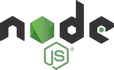
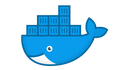

# Hesoyam Pharmacy frontend

[![Azure Build][azure-shield]][azure-url] [![Azure Deployment][azure-deployment-shield]][azure-deployment-url]

[![Docker image][docker-shield]][docker-url]

## Technologies

| Technology | Description |
| :--------: | ----------- |
|  | [Node.js](https://nodejs.org/en/) is an open-source, cross-platform, back-end JavaScript runtime environment that runs on the Chrome V8 engine and executes JavaScript code outside a web browser.|
|  | [npm](https://www.npmjs.com/) is a package manager for the JavaScript programming language.|
|  | [Vue.js](https://vuejs.org/) is an open-source model–view–viewmodel front end JavaScript framework for building user interfaces and single-page applications.|
|  |[Azure DevOps Server](https://azure.microsoft.com/en-us/services/devops/) is a Microsoft product that provides version control, reporting, requirements management, project management, automated builds, testing and release management capabilities.|
|  |[Docker](https://www.docker.com/) is a set of platform as a service (PaaS) products that use OS-level virtualization to deliver software in packages called containers.|
|  |[Nginx](https://nginx.org/) is a web server that can also be used as a reverse proxy, load balancer, mail proxy and HTTP cache.|
|  | [Heroku](https://dashboard.heroku.com/) is a cloud platform as a service (PaaS) supporting several programming languages.|

## How to run

### Prerequisites

It is necessary that you have the following software installed:
- [Node.js](https://nodejs.org/en/)
  - [Download](https://nodejs.org/en/download/) Node.js
  - or [use](https://nodejs.org/en/download/package-manager/) your favourite package manager

> Node.js comes with npm installed. This project was tested on Node.js v.14.15.0 LTS with npm 6.14.8

### Project setup
```
npm install
```

### Compiles and hot-reloads for local development
```
npm run serve
```

### Compiles and minifies for production
```
npm run build
```

#### Customize configuration
See [Configuration Reference](https://cli.vuejs.org/config/).

## Environment variables

Make sure you set the following environment variable in the [.env](.env) file:

`VUE_APP_API_BASE_URL` - Backend API BASE URL (Local dev: `http://localhost:55555/`)

## Backend project

Backend project can be found at [https://github.com/HesoyamGroup/Hesoyam-Pharmacy](https://github.com/HesoyamGroup/Hesoyam-Pharmacy).

[azure-shield]: https://dev.azure.com/hesoyam-pharmacy/hesoyam-pharmacy/_apis/build/status/Hesoyam%20Pharmacy%20front%20CI%20-%20DockerHub
[azure-url]: https://dev.azure.com/hesoyam-pharmacy/hesoyam-pharmacy/_build/latest?definitionId=1
[azure-deployment-shield]: https://vsrm.dev.azure.com/hesoyam-pharmacy/_apis/public/Release/badge/d34da562-ed58-4df6-bc28-328e3229c9ae/1/1
[azure-deployment-url]: https://dev.azure.com/hesoyam-pharmacy/hesoyam-pharmacy/_release?_a=releases&view=mine&definitionId=1

[docker-shield]: https://img.shields.io/docker/image-size/gregvader/hesoyam-pharmacy-front?label=Docker%20image&logo=docker&logoColor=white
[docker-url]: https://hub.docker.com/r/gregvader/hesoyam-pharmacy-front


